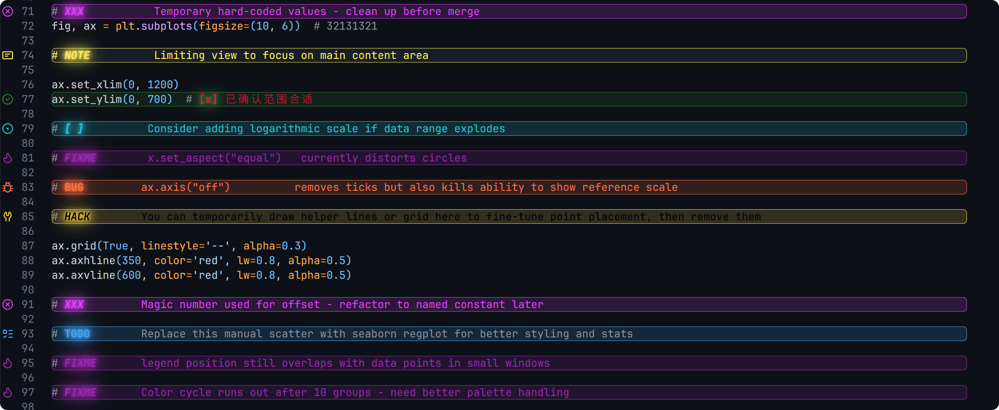

# TaskVision

[中文文档](README_zh.md) | English

TaskVision highlights TODO-style tags in code comments and shows them in a tree view.



> [!IMPORTANT]
> TaskVision 2.0 uses a **four-channel** highlight model. Legacy `type` scope is deprecated for styling.

## Quick Start

Add this to `settings.json`:

```json
"taskvision.highlights.customHighlight": {
  "TODO": {
    "icon": "tasklist",
    "foreground": "#42A5F5",
    "scheme": "neon+glass",
    "colorType": "text",
    "glowType": "tag",
    "glassType": "whole-line",
    "fontType": "tag"
  },
  "FIXME": {
    "icon": "flame",
    "foreground": "#FF5252",
    "scheme": "neon+glass",
    "colorType": "text",
    "glowType": "tag",
    "glassType": "whole-line",
    "fontType": "tag"
  },
  "[ ]": {
    "icon": "issue-opened",
    "foreground": "#26C6DA",
    "scheme": "neon+glass",
    "colorType": "text",
    "glowType": "tag",
    "glassType": "whole-line",
    "fontType": "tag"
  },
  "[x]": {
    "icon": "issue-closed",
    "foreground": "#2E7D32",
    "scheme": "neon+glass",
    "colorType": "text",
    "glowType": "tag",
    "glassType": "whole-line",
    "fontType": "tag"
  },
  "[ x]": {
    "icon": "issue-closed",
    "foreground": "#2E7D32",
    "scheme": "neon+glass",
    "colorType": "text",
    "glowType": "tag",
    "glassType": "whole-line",
    "fontType": "tag"
  }
}
```

## Four Channels

- `colorType`: where text color applies.
- `glowType`: where neon glow (`text-shadow`) applies.
- `glassType`: where glass background applies.
- `fontType`: where font style applies (`fontWeight`, `fontStyle`, `textDecoration`).

Supported scopes:

- `tag`
- `text`
- `tag-and-comment`
- `text-and-comment`
- `tag-and-subTag`
- `line`
- `whole-line`
- `none`

## Scheme Semantics

- `scheme: "neon"` enables glow preset parameters.
- `scheme: "glass"` enables glass preset parameters.
- `scheme: "neon+glass"` enables both.
- `scheme` no longer controls scope.

## Command Palette Tips

`TaskVision: Customize Appearance` now supports independent scope edits:

- Set Color Scope (`colorType`)
- Set Glow Scope (`glowType`)
- Set Glass Scope (`glassType`)
- Set Font Scope (`fontType`)

When a workspace is open, TaskVision writes appearance changes to **Workspace** settings first.

## FAQ

**Q: Why did command changes look ineffective?**
A: Workspace settings (`.vscode/settings.json`) override global user settings.

**Q: Why is body text italic unexpectedly?**
A: Set `fontType` to `tag` so font styles affect only tags.

**Q: How to get full-line glass + tag-only glow + colored body text?**
A: Use `glassType: "whole-line"`, `glowType: "tag"`, `colorType: "text"`.

## Install

```bash
ext install taskvision
```
