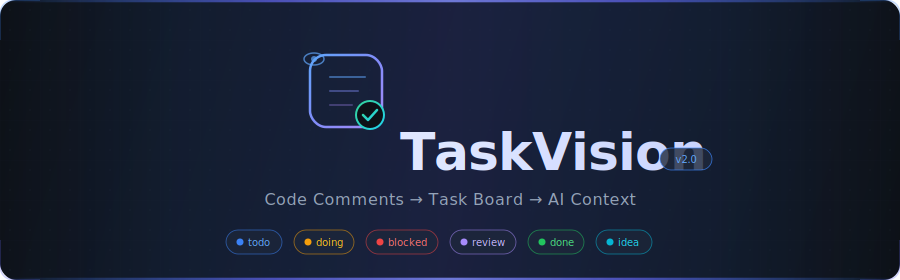
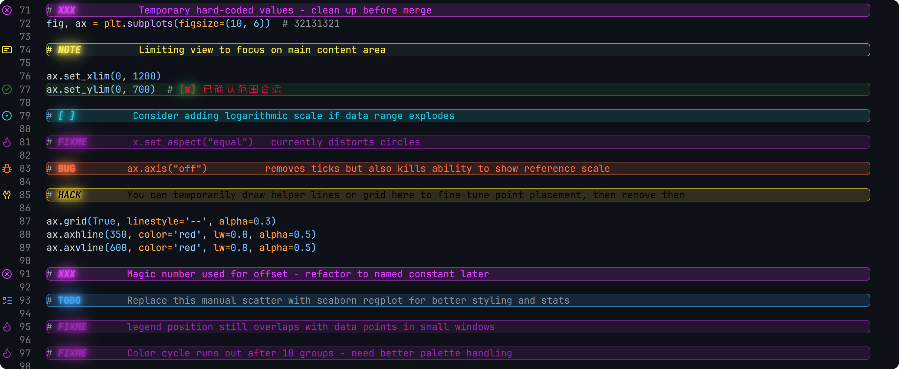

<p align="center">
  
</p>

<p align="center">
  <kbd>&nbsp; 中文 &nbsp;</kbd>&ensp;|&ensp;<a href="README.md"><kbd>&nbsp; English &nbsp;</kbd></a>
</p>

<p align="center">
  <a href="#"></a>&nbsp;
  <a href="#"></a>&nbsp;
  <a href="#"></a>&nbsp;
  <a href="#"></a>&nbsp;
  <a href="#"></a>
</p>

<br/>

<p align="center">
  <strong>把代码注释升级成真正的任务面板，并为 AI 编程工具导出稳定上下文。</strong>
</p>

<br/>

TaskVision 会把代码中的 TODO 类注释转成 VS Code 里的任务树。它保留了传统能力——高亮标签、树视图集中展示、快速跳转回源码——同时新增了内联状态、优先级与备注元数据、AI 上下文导出、状态变化报告，以及基于状态的筛选。

```bash
code --install-extension A-Znk.taskvision
```



> [!IMPORTANT]
> TaskVision 2.0 使用**四通道高亮模型**。样式范围现在拆分为 `colorType`、`glowType`、`glassType`、`fontType`。

---

## 功能一览

<table>
<tr>
<td width="50%">

**任务管理**
- 在源码注释里高亮 TODO 类标签和 Markdown checkbox
- 在树视图、平铺视图、标签视图中统一管理任务
- 解析 `[todo]`、`[blocked]`、`[review]` 等内联状态
- 在树里区分 `task`、`context`、`review` 三类注释
- 把稳定 ID、优先级、备注和上下文关联写入 `.taskvision/tasks-meta.json`

</td>
<td width="50%">

**AI 集成**
- 导出 `ai-context.md`、`ai-context.json`、`ai-status-report.md`
- 在 `context-index.json` 中持久化上下文卡片
- 在 `change-sessions/*.json` 中持久化 planning / review 会话
- 允许外部 AI 工具通过源码注释和官方同步命令回写协作信息
- 自动排除生成的 AI 上下文，避免说明文件反向污染扫描
- 兼容 Claude Code、Codex 及任何 Markdown/JSON 消费工具

</td>
</tr>
</table>

---

## 任务状态

TaskVision 内置以下状态：

| 状态 | 含义 | 状态 | 含义 |
| :---: | :--- | :---: | :--- |
| `todo` | 明确待处理 | `review` | 已处理，等待验证 |
| `doing` | 正在处理 | `done` | 已完成 |
| `blocked` | 被外部依赖阻塞 | `wontdo` | 明确不做 |
| `paused` | 暂时搁置 | `idea` | 想法或观察，还未进入正式任务流 |

```ts
// TODO [todo] [tv:id=task.task.19d80a] 重构缓存失效逻辑
// TODO [blocked] [tv:id=task.api-schema.9950a8] 等待 API schema
// TODO [review] [tv:id=task.qa.371dc2] 重试流程已改完，等待 QA
// NOTE [idea] [tv:id=task.parser-renderer.f4916c] 可以拆分 parser 和 renderer
```

**兼容规则：**

| 简写 | 映射为 |
| :--- | :--- |
| `[ ]` | `todo` |
| `[x]` / `[ x]` | `done` |
| `NOTE` / `IDEA` | `idea` |
| 纯 `TODO`（不写状态） | `todo` |

---

## AI 协作语法

TaskVision 支持在 `TAG [status]` 之后继续写 `tv:` 指令：

```ts
// TODO [todo] [tv:id=task.auth-refresh.c3f12a] 修复 refresh 并发问题
// NOTE [idea] [tv:id=ctx.auth-refresh.8a91de] [tv:ctx=invariant] refresh 必须保持 single-flight
// NOTE [review] [tv:session=sess.20260308.codex.001] [tv:task=task.auth-refresh.c3f12a] [tv:review=verify] 验证重试分支
```

源码里的三类注释：

| 类型 | 常见形态 | 作用 |
| :--- | :--- | :--- |
| `task` | `TODO/FIXME/[ ]/[x] + [tv:id]` | 进入任务状态流的工作项 |
| `context` | `NOTE [idea] + [tv:ctx=...]` | 人类或 AI 标注的重要约束、决策、不变量 |
| `review` | `NOTE [review] + [tv:session=...] + [tv:review=...]` | 带会话 ID 的 AI review / follow-up 注释 |

支持的 `tv:` 指令：

| 指令 | 说明 |
| :--- | :--- |
| `[tv:id=...]` | 任务或上下文锚点的稳定 ID |
| `[tv:ctx=...]` | 上下文类型，如 `must-read`、`constraint`、`invariant`、`decision` |
| `[tv:task=...]` | 关联的任务 stable ID，可写多个 |
| `[tv:review=...]` | review 类型，如 `changed`、`why`、`risk`、`verify`、`blocked`、`followup` |
| `[tv:session=...]` | 当前 planning / review / implementation 会话 ID |

---

## 树视图工作流

在树视图里可以直接完成完整的任务 + AI 协作流：

| 操作 | 作用 |
| :--- | :--- |
| **Set Task Status** | 直接改源码里的 `[status]` |
| **Set Task Priority** | 把优先级写入 `.taskvision/tasks-meta.json` |
| **Edit Task Note** | 给 AI 总结和交接补充备注 |
| **Add Context Annotation** | 在当前行上方插入 `NOTE [idea] [tv:ctx=...] ...` 上下文注释 |
| **Start Agent Session** | 创建或切换当前工作区的活跃 AI 会话 |
| **Write Agent Annotations** | 在当前行上方插入 `NOTE [review] [tv:session=...] [tv:review=...] ...` |
| **Sync Data Model** | 对齐源码注释、sidecar JSON 和导出的 AI 上下文 |
| **Add Missing Inline Statuses** | 给可见范围内还没写状态的任务补上状态文字 |
| **Filter By Status** | 按一个或多个状态筛选树 |
| **Clear Status Filter** | 清除状态筛选 |

> [!NOTE]
> - 批量补状态默认作用于当前可见范围。
> - 从文件夹、文件、标签、task、context 或 review 节点右键触发时，只处理该子树。
> - 导出的 AI 文件会被扫描器忽略，打开 `ai-context.md` 不会把说明文字识别成任务。
> - task 节点显示任务元数据，context 节点显示 `ctx:<kind>`，review 节点显示 `review:<kind>`。

---

## AI 上下文导出

TaskVision 会为外部 AI 编程工具生成一组稳定的交接文件：

```
.taskvision/
├── ai-context.md                 # 人类可读的统一上下文包
├── ai-context.json               # 机器可读的统一上下文包
├── ai-status-report.md           # 任务状态变化摘要
├── tasks-meta.json               # 任务元数据与 stable ID 索引
├── context-index.json            # 上下文卡片
└── change-sessions/
    └── sess.<date>.<actor>.<n>.json
```

`ai-context.json` v2 至少包含：

- `tasks`：带 stable ID、优先级、备注、contextRefs 的任务
- `contexts`：来自 `context-index.json` 的相关上下文卡片
- `openSessions`：来自 `change-sessions/` 的开放会话
- `readOrder`：建议 AI 的阅读顺序

最小结构：

```json
{
  "version": 2,
  "generatedAt": "2026-03-08T12:34:56.000Z",
  "workspaceRoot": "/workspace",
  "scope": "visible-tree",
  "tasks": [],
  "contexts": [],
  "openSessions": [],
  "readOrder": []
}
```

<details>
<summary><strong>推荐的 AI 协议</strong></summary>

<br/>

| 规则 | 说明 |
| :--- | :--- |
| 走官方同步 | 修改源码注释后执行 `Sync Data Model` 或 `Export AI Context` |
| 优先 `review` | 未验证完成前改成 `review`，不要直接跳 `done` |
| 不碰 sidecar | 不要直接修改 `.taskvision/*.json`，除非由 TaskVision 命令生成 |
| 回传变更 | 回传 stable task / session ID、涉及文件和变更原因 |

</details>

### 最小工作流

1. 选中任务后执行 **Add Context Annotation**，补充约束或不变量。
2. 执行 **Start Agent Session**，再通过 **Write Agent Annotations** 记录本轮 review 注释。
3. 执行 **Export AI Context**，生成统一上下文包交给下一个 agent。

---

## 四通道高亮模型

TaskVision 使用四个独立样式通道：

```
┌───────────────────────────────────────────────┐
│  colorType   →  控制文字染色范围              │
│  glowType    →  控制辉光范围                  │
│  glassType   →  控制玻璃背景范围              │
│  fontType    →  控制字体粗细、斜体、装饰线     │
└───────────────────────────────────────────────┘
```

**支持的范围：** `tag` · `text` · `tag-and-comment` · `text-and-comment` · `tag-and-subTag` · `line` · `whole-line` · `none`

**scheme 规则：**

| Scheme | 效果 |
| :--- | :--- |
| `"neon"` | 只启用辉光预设 |
| `"glass"` | 只启用玻璃预设 |
| `"neon+glass"` | 同时启用两者 |

> `scheme` 只控制预设启用，不再决定作用范围。

---

## 快速开始

把下面配置加到 `settings.json`：

```jsonc
"taskvision.highlights.customHighlight": {
  "TODO": {
    "icon": "tasklist",
    "foreground": "#42A5F5",
    "scheme": "neon+glass",
    "colorType": "text",
    "glowType": "tag",
    "glassType": "whole-line",
    "fontType": "tag"
  },
  "FIXME": {
    "icon": "flame",
    "foreground": "#FF5252",
    "scheme": "neon+glass",
    "colorType": "text",
    "glowType": "tag",
    "glassType": "whole-line",
    "fontType": "tag"
  },
  "[ ]": {
    "icon": "issue-opened",
    "foreground": "#26C6DA",
    "scheme": "neon+glass",
    "colorType": "text",
    "glowType": "tag",
    "glassType": "whole-line",
    "fontType": "tag"
  },
  "[x]": {
    "icon": "issue-closed",
    "foreground": "#2E7D32",
    "scheme": "neon+glass",
    "colorType": "text",
    "glowType": "tag",
    "glowType": "tag",
    "glassType": "whole-line",
    "fontType": "tag"
  }
}
```

然后写一些这样的注释试试：

```ts
// TODO [todo] [tv:id=task.onboarding.7e4666] 发布新版 onboarding
// TODO [blocked] [tv:id=task.task.3be64c] 等法务文案
// TODO [review] [tv:id=task.task.11d4d6] 快捷键逻辑已改完
// NOTE [idea] [tv:id=task.command-layer-render-lay.3e95c7] 可以拆成 command layer 和 render layer
```

### 分通道亮度控制

高亮是多层叠加出来的，你现在可以分别调文字、辉光、玻璃背景和玻璃边框：

```jsonc
"taskvision.highlights.foregroundOpacity": 90,
"taskvision.highlights.glowOpacity": 45,
"taskvision.highlights.glassOpacity": 12,
"taskvision.highlights.glassBorderOpacity": 30
```

这些键也可以写在 `taskvision.highlights.customHighlight` 的单个标签配置里。旧的 `opacity` 仍然保留，但现在只是 `glassOpacity` 的兼容别名。

---

## 设置项

| 设置项 | 默认值 | 作用 |
| :--- | :---: | :--- |
| `taskvision.tree.showStatusPrefix` | `true` | 在默认标签文案前补 `[status]` |
| `taskvision.tasks.defaultPriority` | `normal` | 没有元数据时的默认优先级 |
| `taskvision.aiContext.outputDir` | `.taskvision` | AI 上下文输出目录 |
| `taskvision.aiContext.respectCurrentFilters` | `true` | 导出时只使用当前可见树范围 |

---

## 常见问题

<details>
<summary><strong>为什么生成的 AI 上下文不再出现在树里？</strong></summary>
<br/>
因为 TaskVision 会主动排除输出目录，避免自指和误识别。
</details>

<details>
<summary><strong>为什么有些任务没写状态也会显示状态？</strong></summary>
<br/>
因为扩展会根据标签推导默认状态。如果你希望把这些默认值真正写回源码，可以执行 <code>Add Missing Inline Statuses</code>。
</details>

<details>
<summary><strong>为什么我改了外观但看起来没生效？</strong></summary>
<br/>
<code>.vscode/settings.json</code> 里的工作区配置会覆盖全局配置，而 TaskVision 在可能时会优先写入工作区设置。
</details>

---

## 相关代码入口

```
src/
├── extension.js          # 主入口与命令
├── tree.js               # 树视图与节点展示
├── taskState.js          # 状态模型
├── taskMetaStore.js      # 任务元数据与 stable 索引
├── contextStore.js       # 上下文卡片 sidecar
├── changeSessionStore.js # 会话 sidecar
├── annotationParser.js   # `tv:` 指令解析
└── aiContext.js          # 统一 AI 上下文导出
```

---

<p align="center">
  <sub>MIT License &copy; 2026 TaskVision</sub>
</p>
