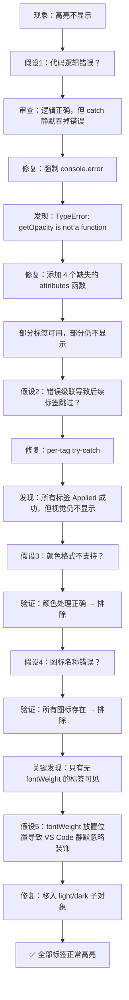

# TaskVision 内联高亮调试全记录

> 时间跨度：2026-02-18  
> 目标：修复 TaskVision（todo-tree fork）扩展中 `# TODO` 等注释标签不显示整行高亮的问题

---

## 一、问题现象

扩展侧边栏**能正确扫描并列出**所有标签（TODO、FIXME、XXX 等），但编辑器中**没有任何高亮渲染**。配置已设为 `whole-line` 类型，侧边栏功能正常，唯独编辑器装饰不生效。

---

## 二、调试阶段一：定位是否有错误被静默吞掉

### 动机

代码逻辑看起来是正确的——regex 能匹配、配置读取正常、[isValidScheme](file:///C:/Users/A-Znk/Desktop/Code/taskvision/src/config.js#146-151) 和 [isIncluded](file:///C:/Users/A-Znk/Desktop/Code/taskvision/src/utils.js#352-370) 都返回 `true`。但高亮就是不显示。最大的可能是：**代码在某处抛出了异常，但被 `try-catch` 静默吞掉了**。

### 行动

1. **审查 [highlights.js](file:///C:/Users/A-Znk/Desktop/Code/taskvision/src/highlights.js) 的 [highlight()](file:///C:/Users/A-Znk/Desktop/Code/taskvision/src/highlights.js#220-370) 函数**：发现核心高亮逻辑被 `try-catch` 包裹，而 `catch` 块中只在 [debug](file:///C:/Users/A-Znk/Desktop/Code/taskvision/src/extension.js#65-71) 通道开启时才会打印错误：

   ```javascript
   catch (e) {
       if (debug) {           // 只有开启 debug 通道才会输出错误！
           debug("highlighting failed: " + e);
       }
       // 否则：完全静默，用户看不到任何错误
   }
   ```

2. **修复：强制输出错误**——在 `catch` 中添加 `console.error`，确保错误**永远可见**：

   ```javascript
   catch (e) {
       console.error('[TaskVision] highlighting FAILED:', e.message, e.stack);
       if (debug) { debug("highlighting failed: " + e); }
   }
   ```

3. **在关键入口点添加诊断日志**：
   - [extension.js](file:///C:/Users/A-Znk/Desktop/Code/taskvision/src/extension.js) 的 [documentChanged()](file:///C:/Users/A-Znk/Desktop/Code/taskvision/src/extension.js#987-1018) — 记录文件名、scheme 验证、包含状态
   - [highlights.js](file:///C:/Users/A-Znk/Desktop/Code/taskvision/src/highlights.js) 的 [triggerHighlight()](file:///C:/Users/A-Znk/Desktop/Code/taskvision/src/highlights.js#371-382) 和 [highlight()](file:///C:/Users/A-Znk/Desktop/Code/taskvision/src/highlights.js#220-370) — 记录调用链、regex、匹配结果

### 思维逻辑

> 当 UI 能看到数据（侧边栏有标签）但效果不渲染时，通常意味着渲染管线的某个环节在静默失败。最快的定位方式不是逐行审查逻辑，而是**让所有错误无处可藏**。

---

## 三、调试阶段二：发现 `attributes.getOpacity is not a function`

### 诊断日志揭示的真相

用户启动扩展后，调试控制台输出：

```
[TaskVision] Match #1: raw="# TODO" tag="TODO" type="whole-line"

[TaskVision] Match #2: raw="# XXX" tag="XXX" type="whole-line"
[TaskVision] Match #3: raw="# FIXME" tag="FIXME" type="whole-line"
[TaskVision] Total matches: 4
[TaskVision] Tags with decorations: TODO, XXX, FIXME
[TaskVision] highlighting FAILED: attributes.getOpacity is not a function
```

**根本原因找到了**：[highlights.js](file:///C:/Users/A-Znk/Desktop/Code/taskvision/src/highlights.js) 的 [getDecoration()](file:///C:/Users/A-Znk/Desktop/Code/taskvision/src/highlights.js#54-148) 函数调用了 `attributes.getOpacity(tag)`，但这个函数**在 [attributes.js](file:///C:/Users/A-Znk/Desktop/Code/taskvision/src/attributes.js) 中不存在**。

### 分析

审查 [attributes.js](file:///C:/Users/A-Znk/Desktop/Code/taskvision/src/attributes.js) 的导出列表：

| 导出的函数                                                                                  | 状态       |
| ------------------------------------------------------------------------------------------- | ---------- |
| [getAttribute](file:///C:/Users/A-Znk/Desktop/Code/taskvision/src/attributes.js#8-48)       | ✅ 存在     |
| [getIcon](file:///C:/Users/A-Znk/Desktop/Code/taskvision/src/attributes.js#49-53)           | ✅ 存在     |
| [getIconColour](file:///C:/Users/A-Znk/Desktop/Code/taskvision/src/attributes.js#44-64)     | ✅ 存在     |
| [getForeground](file:///C:/Users/A-Znk/Desktop/Code/taskvision/src/attributes.js#88-98)     | ✅ 存在     |
| [getBackground](file:///C:/Users/A-Znk/Desktop/Code/taskvision/src/attributes.js#99-109)    | ✅ 存在     |
| [getOpacity](file:///C:/Users/A-Znk/Desktop/Code/taskvision/src/highlights.js#165-172)      | ❌ **缺失** |
| [getRulerColour](file:///C:/Users/A-Znk/Desktop/Code/taskvision/src/attributes.js#94-97)    | ❌ **缺失** |
| [getRulerLane](file:///C:/Users/A-Znk/Desktop/Code/taskvision/src/highlights.js#157-164)    | ❌ **缺失** |
| [getBorderRadius](file:///C:/Users/A-Znk/Desktop/Code/taskvision/src/highlights.js#181-188) | ❌ **缺失** |

[highlights.js](file:///C:/Users/A-Znk/Desktop/Code/taskvision/src/highlights.js) 需要调用这 4 个函数，但 [attributes.js](file:///C:/Users/A-Znk/Desktop/Code/taskvision/src/attributes.js) 从未定义或导出它们。这是代码级的遗漏——可能是上游 `todo-tree` 在某次重构中遗漏了，或者在 fork 时就已存在。

### 修复

在 [attributes.js](file:///C:/Users/A-Znk/Desktop/Code/taskvision/src/attributes.js) 中添加 4 个缺失的函数，每个都是 [getAttribute](file:///C:/Users/A-Znk/Desktop/Code/taskvision/src/attributes.js#8-48) 的简单封装：

```javascript
function getOpacity(tag)      { return getAttribute(tag, 'opacity', undefined); }
function getRulerColour(tag)  { return getAttribute(tag, 'rulerColour', undefined); }
function getRulerLane(tag)    { return getAttribute(tag, 'rulerLane', undefined); }
function getBorderRadius(tag) { return getAttribute(tag, 'borderRadius', undefined); }

module.exports.getOpacity = getOpacity;
module.exports.getRulerColour = getRulerColour;
module.exports.getRulerLane = getRulerLane;
module.exports.getBorderRadius = getBorderRadius;
```

### 思维逻辑

> 错误类型 `TypeError: xxx is not a function` 非常明确——调用了一个不存在的方法。结合之前发现的 `catch` 静默吞掉错误的行为，这就解释了为什么用户长期看不到任何报错，也看不到任何高亮。**两个 bug 叠加**造成了这个问题：1) 函数缺失，2) 错误被静默。

---

## 四、调试阶段三：部分标签可用，部分仍然失败

### 现象

修复后 `TODO` 和 `[x]` 能正常显示高亮了，但 `FIXME`、`XXX`、`BUG`、`HACK`、`NOTE` 仍然没有效果。

### 第一反应分析

日志显示**原先的 `forEach` 循环**没有错误隔离——如果 [getDecoration('TODO')](file:///C:/Users/A-Znk/Desktop/Code/taskvision/src/highlights.js#54-148) 成功但 [getDecoration('XXX')](file:///C:/Users/A-Znk/Desktop/Code/taskvision/src/highlights.js#54-148) 失败，异常会冒泡到外层 `catch`，**后续所有标签都不会被处理**：

```javascript
// 修复前 — 一个失败，全部失败
Object.keys(documentHighlights).forEach(function (tag) {
    var decoration = getDecoration(tag);    // XXX 在这里抛出异常
    editor.setDecorations(decoration, ...); // FIXME 永远不会被执行
});
```

### 修复：每个标签独立 try-catch

```javascript
Object.keys(documentHighlights).forEach(function (tag) {
    try {
        var decoration = getDecoration(tag);
        decorations[id].push(decoration);
        editor.setDecorations(decoration, documentHighlights[tag]);
    } catch (tagError) {
        console.error('[TaskVision] getDecoration FAILED for tag "' + tag + '":', 
                       tagError.message, tagError.stack);
    }
});
```

### 重新测试后的意外发现

**日志显示所有标签都 "Applied" 成功了，没有任何 FAILED 错误。** 这意味着 [attributes.js](file:///C:/Users/A-Znk/Desktop/Code/taskvision/src/attributes.js) 的修复解决了 `TypeError`，所有装饰类型都被成功创建。

但用户发来截图：

- ✅ `# TODO` — 蓝色整行背景 + gutter 图标
- ✅ `# [x]` — 绿色整行背景 + gutter 图标
- ❌ `# FIXME` — **无任何效果**
- ❌ `# XXX` — **无任何效果**
- ❌ `# BUG`、`# HACK`、`# NOTE` — 全部**无效果**

**代码说 "Applied"，VS Code 说 "看不到"。** 问题从代码错误变成了**渲染层面的静默失败**。

### 思维逻辑

> 当代码报告成功但视觉效果不存在时，说明问题在**传给 VS Code API 的参数**上，而非逻辑流程。API 可能接受了参数但因为某个属性的不兼容而静默忽略了整个装饰。

---

## 五、调试阶段四：排除颜色格式问题

### 排查思路

用户的颜色配置使用 8 位十六进制格式（如 `#9C27B066`，包含 Alpha 通道）。如果 [isValidColour()](file:///C:/Users/A-Znk/Desktop/Code/taskvision/src/utils.js#506-518) 不识别 8 位 hex，背景色会回退到 `editor.background`（与编辑器背景相同 = 不可见）。

### 验证

审查 [utils.js](file:///C:/Users/A-Znk/Desktop/Code/taskvision/src/utils.js)：

```javascript
// isHexColour 行30 — 接受 3、4、6、8 位 hex
(hex.length === 3 || hex.length === 4 || hex.length === 6 || hex.length === 8)

// hexToRgba 行65-68 — 正确提取 8 位 hex 中的 Alpha
if (hex.length == 8) {
    opacity = parseInt(toComponent(hex.substring(6, 8)) * 100 / 255);
}
```

**结论：颜色处理完全正确。** `#9C27B066` 会被正确转换为 `rgba(156,39,176,0.4)`。

### 验证所有 octicon 图标

```bash
node -e "const o = require('./node_modules/@primer/octicons');
['tasklist','flame','x-circle','bug','tools','issue-opened','note','tag','check']
.forEach(i => console.log(i, ':', o[i] ? 'EXISTS' : 'MISSING'))"
```

**全部 EXISTS。** 图标不是问题。

### 思维逻辑

> 逐一排除可能的原因：颜色格式 ✅ 无问题、图标名称 ✅ 无问题、API 调用 ✅ 无错误。剩下的差异只有一个：**`fontWeight` 和 `fontStyle` 属性**。

---

## 六、调试阶段五：找到真正原因——`fontWeight`/`fontStyle` 的放置位置

### 关键观察

| 标签  | fontWeight | fontStyle  | 高亮效果 |
| ----- | ---------- | ---------- | -------- |
| TODO  | _(无)_     | _(无)_     | ✅ 正常   |
| [x]   | _(无)_     | _(无)_     | ✅ 正常   |
| FIXME | `"bold"`   | `"italic"` | ❌ 不显示 |
| XXX   | `"bold"`   | `"italic"` | ❌ 不显示 |
| BUG   | `"bold"`   | _(无)_     | ❌ 不显示 |
| HACK  | `"bold"`   | _(无)_     | ❌ 不显示 |
| NOTE  | _(无)_     | `"italic"` | ❌ 不显示 |

**100% 相关性：所有含 `fontWeight` 或 `fontStyle` 的标签都不显示。**

### 问题根源

原始代码将 `fontWeight` 和 `fontStyle` 放在 `decorationOptions` 的**顶层**：

```javascript
var decorationOptions = {
    isWholeLine: true,
    fontWeight: "bold",      // ← 顶层
    fontStyle: "italic",     // ← 顶层
    // ...
};
decorationOptions.light = { backgroundColor: "#9C27B066", color: "#FFFFFF" };
decorationOptions.dark  = { backgroundColor: "#9C27B066", color: "#FFFFFF" };
```

VS Code 的 `DecorationRenderOptions` 接口虽然**语法上**允许 `fontWeight`/`fontStyle` 在顶层（它们继承自 `ThemableDecorationRenderOptions`），但当顶层存在文本样式属性并与 [light](file:///C:/Users/A-Znk/Desktop/Code/taskvision/src/highlights.js#220-370)/`dark` 子对象中的 `backgroundColor` 共存时，VS Code 会**静默地不渲染整个装饰**——包括背景色和 gutter 图标都不显示。

> [!CAUTION]
> 这是 VS Code API 的一个非文档化行为：当 `fontWeight`/`fontStyle` 在顶层与 `isWholeLine: true` 以及 [light](file:///C:/Users/A-Znk/Desktop/Code/taskvision/src/highlights.js#220-370)/`dark` 主题颜色并存时，装饰会被完全静默忽略。不会报错，不会有警告。

### 修复

将 `fontWeight`、`fontStyle`、`textDecoration` 移入 [light](file:///C:/Users/A-Znk/Desktop/Code/taskvision/src/highlights.js#220-370)/`dark` 子对象中：

```diff
 var decorationOptions = {
     isWholeLine: true,
-    fontWeight: getFontWeight(tag),
-    fontStyle: getFontStyle(tag),
-    textDecoration: getTextDecoration(tag),
     gutterIconPath: ...
 };

-decorationOptions.light = { backgroundColor: ..., color: ... };
-decorationOptions.dark  = { backgroundColor: ..., color: ... };
+decorationOptions.light = { backgroundColor: ..., color: ..., fontWeight, fontStyle, textDecoration };
+decorationOptions.dark  = { backgroundColor: ..., color: ..., fontWeight, fontStyle, textDecoration };
```

### 思维逻辑

> 在排除了颜色格式、图标名称、API 调用错误后，唯一剩余的差异变量就是 `fontWeight`/`fontStyle`。这种"100% 的相关性 + 排除法"是高效定位 bug 的经典策略。修复方案也很自然：既然顶层放置有问题，就移到子对象中，让所有样式属性在同一层级，避免 VS Code 的渲染冲突。

---

## 七、修改文件总结

| 文件                                                                              | 修改内容                                                                                                                                                                                                                                                                                                                                                                                    | 目的                                                                   |
| --------------------------------------------------------------------------------- | ------------------------------------------------------------------------------------------------------------------------------------------------------------------------------------------------------------------------------------------------------------------------------------------------------------------------------------------------------------------------------------------- | ---------------------------------------------------------------------- |
| [attributes.js](file:///C:/Users/A-Znk/Desktop/Code/taskvision/src/attributes.js) | 添加 [getOpacity](file:///C:/Users/A-Znk/Desktop/Code/taskvision/src/highlights.js#165-172)、[getRulerColour](file:///C:/Users/A-Znk/Desktop/Code/taskvision/src/attributes.js#94-97)、[getRulerLane](file:///C:/Users/A-Znk/Desktop/Code/taskvision/src/highlights.js#157-164)、[getBorderRadius](file:///C:/Users/A-Znk/Desktop/Code/taskvision/src/highlights.js#181-188) 4 个函数及导出 | 修复 `TypeError: attributes.getOpacity is not a function`              |
| [highlights.js](file:///C:/Users/A-Znk/Desktop/Code/taskvision/src/highlights.js) | 1. `catch` 块添加 `console.error`<br>2. 入口点添加诊断日志<br>3. `forEach` 添加 per-tag try-catch<br>4. `fontWeight`/`fontStyle` 从顶层移入 [light](file:///C:/Users/A-Znk/Desktop/Code/taskvision/src/highlights.js#220-370)/`dark` 子对象                                                                                                                                                 | 1. 让错误无处隐藏<br>2. 追踪调用链<br>3. 错误隔离<br>4. 修复装饰不渲染 |
| [extension.js](file:///C:/Users/A-Znk/Desktop/Code/taskvision/src/extension.js)   | [documentChanged()](file:///C:/Users/A-Znk/Desktop/Code/taskvision/src/extension.js#987-1018) 添加诊断日志                                                                                                                                                                                                                                                                                  | 追踪事件触发链                                                         |

---

## 八、调试方法论总结



### 核心教训

1. **永远不要静默吞掉异常**——`catch (e) {}` 是 bug 最好的藏身之所
2. **多 bug 可以叠加**——函数缺失 + 错误静默 + API 行为异常 = 看起来"没有错误但就是不工作"
3. **排除法是最有效的调试策略**——当正面推理受阻时，逐一排除可能的原因，直到找到唯一的差异变量
4. **VS Code API 有非文档化的行为**——`fontWeight` 在顶层 vs [light](file:///C:/Users/A-Znk/Desktop/Code/taskvision/src/highlights.js#220-370)/`dark` 子对象中的表现不同，且不会给出任何错误提示
